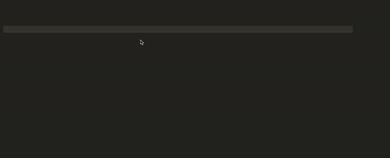
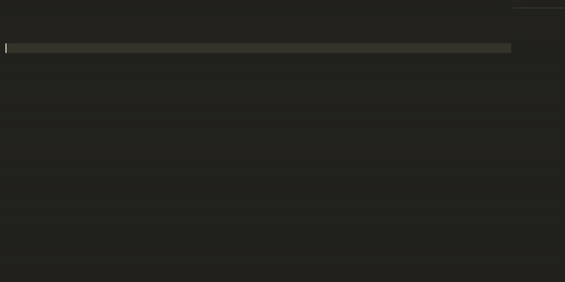

# Redstone API

[](https://choosealicense.com/licenses/mit/)
[](https://github.com/redstone-finance/redstone-api)
[](https://discord.gg/2CT6hN6C)
[](https://www.npmjs.com/package/redstone-api)

[](https://twitter.com/intent/follow?screen_name=limestone_defi)

Redstone API is a Javascript library for fetching trusted token pricing data from [Redstone data ecosystem](docs/REDSTONE_DATA_ECOSYSTEM.md).

It is a Javascript wrapper for [Redstone HTTP Api](docs/HTTP_API.md).

## 🚀 Demo
Try it directly in CodeSandbox: [demo link](https://codesandbox.io/s/redstone-api-demo-0h4oo?from-embed=&file=/src/index.ts)

## ✅ Why Redstone API
### ✓ Secure
Redstone pricing data is secured on Arweave and protected by the provider's collateral.
[Learn more](docs/REDSTONE_DATA_ECOSYSTEM.md)

### ✓ Easy to use
You don't need any API keys. Just install the npm package and add a single line of code.
[Quick start](docs/QUICK_START.md)

### ✓ 100+ tokens
We support BTC, ETH, AR, EUR, and many other crypto and fiat currencies.
[All supported tokens](docs/ALL_SUPPORTED_TOKENS.md)

### ✓ TypeScript Support
Redstone API is fully written in Typescript and then compiled to JavaScript.
[Source code](https://github.com/redstone-finance/redstone-api/)

## 📖 Documentation
This readme should provide you with all the information you need to start using redstone api. If you want to see the full documentation, visit [api.docs.redstone.finance](https://api.docs.redstone.finance)

## 📦 Installation

### Using npm
```bash
npm install redstone-api
```

### Using yarn
```bash
yarn add redstone-api
```

## 🤖 Usage

### Importing

```js
// Using Node.js `require()`
const redstone = require('redstone-api');

// Using ES6 imports
import redstone from 'redstone-api';

```

### Get the latest price for a single token
```js
const price = await redstone.getPrice("AR");

console.log(price.value); // latest price value for AR token (in USD)
console.log(price.timestamp); // the exact timestamp of the price
```
💡 Note: All the prices are denominated in USD. You can fetch price data for BTC, ETH, AR, EUR and any other of [ 100+ supported tokens.](docs/ALL_SUPPORTED_TOKENS.md)

### Available symbols
You can use a `symbols` object to explore all available symbols right in the code.
```js
import redstone from 'redstone-api';
const { symbols } = redstone;

const price = await redstone.getPrice(symbols.AR);
```


<br/>

<details>
  <summary>Price data format</summary>

  ```js
  {
    value: 123.23, // Number: Price value in USD
    timestamp: 1617146511173, // Number: Timestamp (ms) for price
    provider: "I-5rWUehEv-MjdK9gFw09RxfSLQX9DIHxG614Wf8qo0", // String: Provider arweave address
    permawebTx: "V8FUU0BG4kVOJwKWHzgkn1aEFm-eanhqqEXfPFY7pmI", // String: Arweave transaction id
    source: {"coingecko": 123,"sushiswap": 123.23,"uniswap": 123.35}, // Object: Prices from different sources
  }
  ```
</details>

<br/>

<details>
  <summary>Fetch price using promises</summary>

  ```js
  // As async/await is only a syntactic sugar on Javascript
  // Promises you can use them in a "standard" way
  const price = redstone.getPrice("AR").then((price) => {
    console.log(price.value); // latest price value for AR token
  });
  ```
</details>
<br/>

----------------------------------------------

### Get the latest prices for several tokens
To fetch prices for several tokens use the `getPrice` method and pass an array with any subset of [supported tokens](docs/ALL_SUPPORTED_TOKENS.md).
```js
const prices = await redstone.getPrice(["BTC", "ETH", "AR", "EUR"]);

console.log(prices); // Example output below
/*
{
  "BTC": {
    value: 58953.39,
    timestamp: 1617152802779,
    ...
  },
  "ETH": {
    value: 1856.75,
    timestamp: 1617152802779,
    ...
  },
  ...
}
*/


console.log(prices["BTC"].value); // latest price value for BTC
console.log(prices["ETH"].value); // latest price value for ETH
console.log(prices["AR"].value); // latest price value for AR

```

----------------------------------------------

### Get prices for all available tokens
To fetch the latest prices for all available tokens use the `getAllPrices` method.
```js
const prices = await redstone.getAllPrices();

console.log(prices); // Example output below
/*
{
  "BTC": {...},
  "ETH": {...},
  ...
}
*/

console.log(prices["AR"].value); // latest price value for AR
console.log(prices["EUR"].value); // latest price value for EUR
```

----------------------------------------------

### Get the historical price for a single token
To get the historical price use the `getHistoricalPrice` method.
```js
const price = await redstone.getHistoricalPrice("AR", {
  date: "2021-03-30T12:35:09", // Any convertable to date type
});

console.log(price.value); // AR price for specific time
```

💡 Note: `date` argument must be convertable to Date type. You may pass date (e.g. `new Date(2021-04-01)`), timestamp (e.g. `1617709771289`), or just string (e.g. `2021-04-01` or `2021-04-01T12:30:58`).

----------------------------------------------

### Get the historical price for several tokens
To fetch the historical price for several tokens pass an array of symbols to `getHistoricalPrice` method.
```js
const symbols = ["AR", "BTC", "UNI", "ETH", "EUR"];
const prices = await redstone.getHistoricalPrice(symbols, {
  date: "2021-03-30T12:35:09",
});

console.log(prices["BTC"].value); // BTC price for specific time
```

----------------------------------------------

### Get the historical prices in a time range
To fetch the historical prices in a time range specify token symbol as the first argument of the `getHistoricalPrice` method, and `startDate`, `endDate` and `interval` as fields of the second argument.

💡 Note: currently Redstone API supports fetching historical prices in a time range only for a single token.
```js
const prices = await redstone.getHistoricalPrice("AR", {
  startDate: "2021-03-29T12:35:09",
  endDate: "2021-03-30T12:35:09",
  interval: 3600 * 1000, // 1 hour
});

console.log(prices); // Example output below
/*
[
  {
    value: 28.8,
    timestamp: 1617016995624,
    ...
  },
  {
    value: 28.59,
    timestamp: 1617014111705,
    ...
  },
  ...
]
*/
```

💡 Note: `startDate` and `endDate` argument must be convertable to Date type.

### Get prices with pagination
To fetch prices with pagination specify token symbol as the first argument of the `getHistoricalPrice` method, and `offset` with `limit` as properties of the second argument.

💡 Note: pagination is supported only for a single token.

```js
const prices = await redstone.getHistoricalPrices("AR", {
  offset: 1000,
  limit: 100,
});
```

----------------------------------------------

### Verify signature
All prices saved in Redstone have a signature, thanks to which you always can verify if the price data has been submitted by the trusted provider.

To do so you can set `verifySignature` option to `true` in `getPrice`, `getHistoricalPrice` or `getAllPrices` methods. If signature is invalid - error will be thrown.
```js
const price = await redstone.getPrice("AR", {
  verifySignature: true,
});
console.log(price.value);
```

----------------------------------------------

### Fluent Interface
Redstone implements a fluent interface to simplify query creation thanks to a human readable syntax. [Learn more](docs/FLUENT_INTERFACE.md)



----------------------------------------------

### Using a custom cache api url
#### Option 1. Using a setCacheApiUrl method
```js
redstone.setCacheApiUrl("http://localhost:9000/prices");
redstone.getPrice("AR").then(console.log);
```

#### Option 2. Initialising a new redstone api instance with a cacheApiUrl param
```js
const redstoneApi = new redstone.Api({
  cacheApiUrl: "http://localhost:9000/prices",
});
redstoneApi.getPrice("AR").then(console.log);
```

💡 Note: To use a custom cache api url with the redstone fluent interface you should pass a `cacheApiUrl` as an argument of the `exec` method each time you make a query.
```js
redstone.query().symbol("AR").latest().exec({
  cacheApiUrl: "http://localhost:9000/prices",
}).then(console.log);
```

----------------------------------------------

### Get prices from Arweave
By default, Redstone API fetches data from the Redstone cache layer. It works way faster than fetching directly from Arweave Blockchain. Even so, thanks to signature verification prices data is still trusted and secure.

We strongly recommend using the default fetching mechanism which leverages cache to speed up queries. But if you want to fetch data directly from Arweave you can do it by initialising a new `Api` client and setting `useCache` option to `false`.

```js
const redstoneArweaveClient = new redstone.Api({ useCache: false });

const price = await redstoneArweaveClient.getPrice("AR");

console.log(price.value); // AR price value fetched directly from Arweave
```

## 🚀 Examples
- [Discord bots](examples/discord-bots/)
- [Web app](https://github.com/redstone-finance/redstone-app)

## 💬 Contributing
Pull requests are welcome. For major changes, please open an issue first to discuss what you would like to change.

Please make sure to update tests as appropriate.

## 📜 License
This software is licensed under the [MIT](https://choosealicense.com/licenses/mit/) © [Redstone](https://github.com/redstone-finance)
